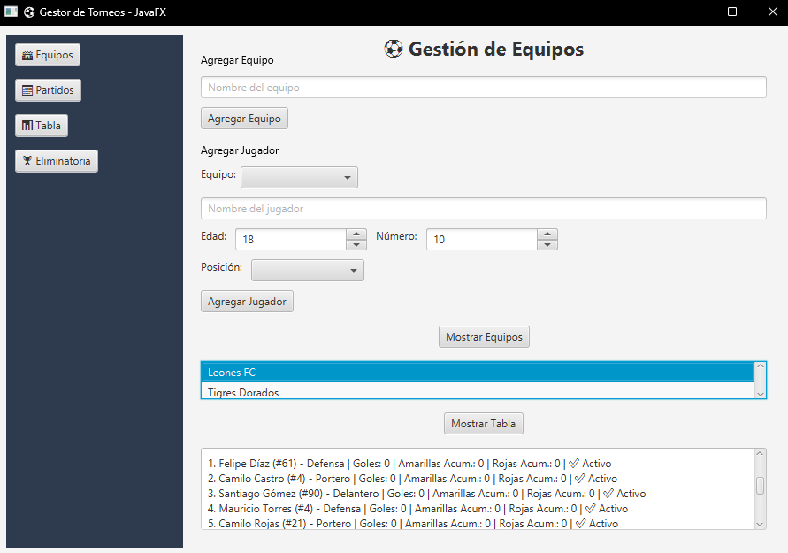
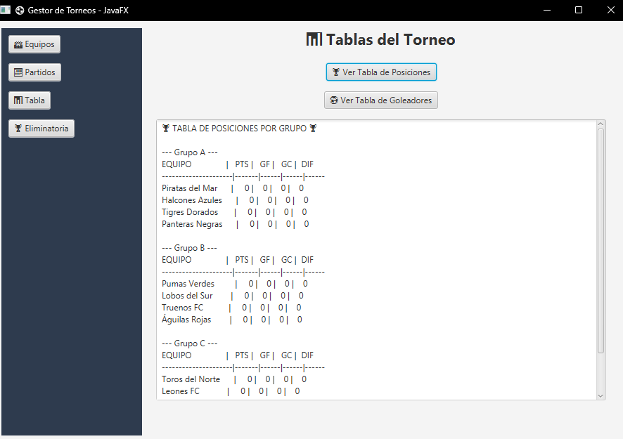
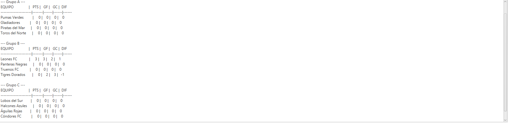
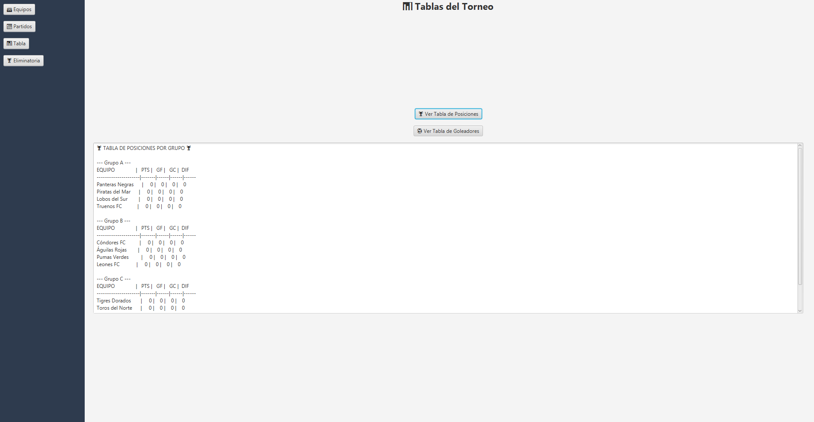
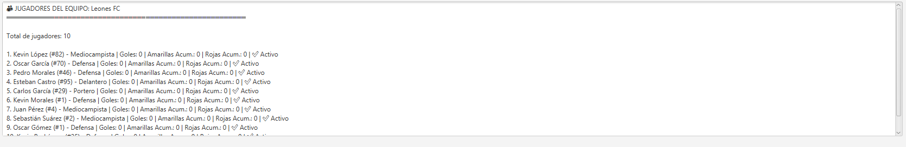
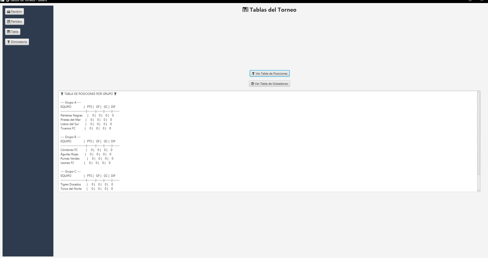
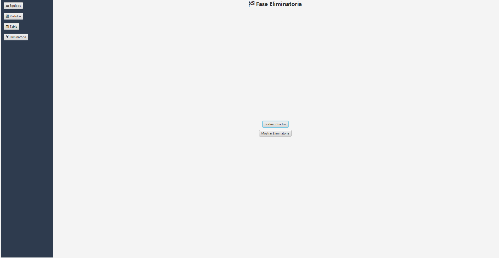
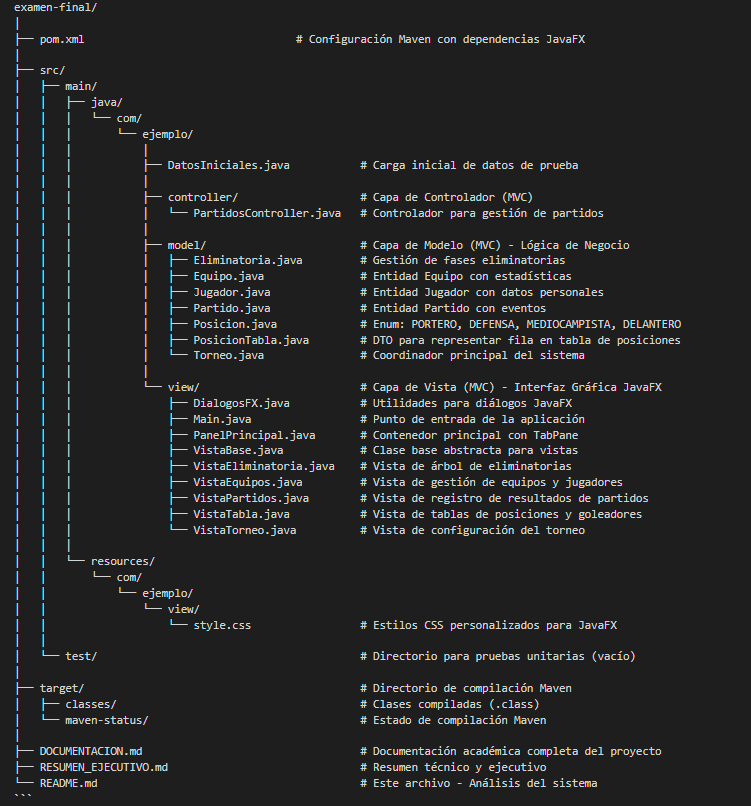

# SISTEMA DE GESTIÓN DE TORNEOS DEPORTIVOS

## ANÁLISIS COMPLETO DEL SISTEMA

---

## 1. EXTRACCIÓN DE REQUERIMIENTOS DEL RELATO

Requerimientos Funcionales (RF)

RF1: El sistema debe permitir crear un torneo deportivo con un nombre único compuesto únicamente por letras y espacios.

RF2: El sistema debe permitir registrar equipos participantes con nombre único alfabético, validando que no existan duplicados en el torneo.

RF3: El sistema debe permitir registrar jugadores con nombre completo, edad (entre 10 y 50 años), posición deportiva (Portero, Defensa, Mediocampista, Delantero) y número de camiseta (1-99) único por equipo.

RF4: El sistema debe asignar jugadores a equipos específicos, estableciendo una relación bidireccional entre jugador y equipo.

RF5: El sistema debe permitir realizar sorteo aleatorio de equipos en grupos cuando existan mínimo 12 equipos registrados, distribuyéndolos equitativamente en grupos de 3 o 4 equipos.

RF6: El sistema debe generar automáticamente el calendario completo de partidos de fase de grupos utilizando sistema round-robin (todos contra todos dentro de cada grupo).

RF7: El sistema debe permitir registrar resultados de partidos con goles del equipo local y visitante como valores numéricos no negativos.

RF8: El sistema debe permitir registrar eventos detallados del partido: goles por jugador específico, tarjetas amarillas y tarjetas rojas a jugadores individuales.

RF9: El sistema debe calcular automáticamente la tabla de posiciones por grupo y general, aplicando: 3 puntos por victoria, 1 punto por empate, 0 puntos por derrota.

RF10: El sistema debe aplicar criterios de desempate en el siguiente orden: mayor cantidad de puntos, mayor diferencia de goles, mayor cantidad de goles a favor, orden alfabético.

RF11: El sistema debe clasificar automáticamente a los 8 mejores equipos para fase eliminatoria: los 2 primeros de cada grupo más los 2 mejores terceros lugares.

RF12: El sistema debe generar automáticamente el sorteo de cuartos de final basándose en el rendimiento de fase de grupos, evitando enfrentamientos prematuros de equipos del mismo grupo.

RF13: El sistema debe avanzar automáticamente entre fases eliminatorias (cuartos, semifinales, final, tercer puesto) cuando todos los partidos de la fase actual estén finalizados.

RF14: El sistema debe permitir resolver partidos empatados en fase eliminatoria mediante tandas de penales, registrando el marcador de penales y determinando el ganador.

RF15: El sistema debe gestionar suspensiones automáticas de jugadores: 2 tarjetas amarillas acumuladas o 1 tarjeta roja directa resultan en suspensión del siguiente partido.

RF16: El sistema debe generar tabla de goleadores ordenada por cantidad de anotaciones, mostrando nombre del jugador, equipo y total de goles.

RF17: El sistema debe mostrar estadísticas completas por equipo: partidos jugados, ganados, empatados, perdidos, goles a favor, goles en contra, diferencia de goles y puntos totales.

RF18: El sistema debe visualizar el árbol de eliminatorias mostrando todos los enfrentamientos desde cuartos de final hasta la final y tercer puesto.

RF19: El sistema debe validar que un equipo no pueda jugar contra sí mismo en ningún partido.

RF20: El sistema debe impedir que se realice el sorteo de grupos más de una vez, manteniendo la integridad del torneo.

---

## 2. REGLAS DEL NEGOCIO

2.1 Catálogo de Entidades y Atributos

TORNEO:
- Nombre: cadena alfabética obligatoria
- Mínimo de equipos para iniciar: 12
- Número de grupos: calculado dinámicamente (3-4 equipos por grupo)
- Estado del torneo: sorteo realizado, partidos generados, fase actual

EQUIPO:
- Nombre: cadena alfabética única obligatoria
- Mínimo de jugadores: 1 (recomendado: 10-20)
- Estadísticas: puntos, goles a favor, goles en contra, partidos jugados/ganados/empatados/perdidos
- Grupo asignado: nullable hasta sorteo

JUGADOR:
- Nombre: cadena alfabética obligatoria
- Edad: entero entre 10 y 50 años
- Posición: enum {PORTERO, DEFENSA, MEDIOCAMPISTA, DELANTERO}
- Número de camiseta: entero entre 1 y 99, único por equipo
- Estadísticas: goles anotados, tarjetas amarillas, tarjetas rojas, suspendido (boolean)
- Equipo: referencia obligatoria al equipo

PARTIDO:
- Equipo local: referencia obligatoria
- Equipo visitante: referencia obligatoria (diferente al local)
- Goles local: entero >= 0
- Goles visitante: entero >= 0
- Estado: jugado (boolean)
- Fase: grupo, cuartos, semifinal, final, tercer_puesto
- Penales (opcional): marcador de penales para fase eliminatoria

2.2 Reglas de Puntuación y Clasificación

Puntuación en Fase de Grupos:
- Victoria: 3 puntos
- Empate: 1 punto
- Derrota: 0 puntos

Criterios de Desempate (aplicados en orden):
1. Mayor cantidad de puntos totales
2. Mayor diferencia de goles (goles a favor - goles en contra)
3. Mayor cantidad de goles a favor
4. Orden alfabético del nombre del equipo

Clasificación a Fase Eliminatoria:
- Clasifican automáticamente: 1° y 2° de cada grupo (6 equipos)
- Clasifican los 2 mejores terceros lugares (comparados entre todos los grupos)
- Total clasificados: 8 equipos

2.3 Reglas de Suspensiones y Tarjetas

Tarjetas Amarillas:
- Acumulación de 2 tarjetas amarillas en el torneo = suspensión automática
- Jugador suspendido no puede participar en el siguiente partido
- Las tarjetas amarillas se resetean después de cumplir suspensión

Tarjetas Rojas:
- 1 tarjeta roja directa = suspensión automática inmediata
- Suspensión mínima de 1 partido
- Se contabiliza en estadísticas del jugador

Registro de Goles:
- Cada gol debe estar asociado a un jugador específico del equipo anotador
- Se incrementa contador de goles del jugador
- Se actualiza automáticamente la tabla de goleadores

2.4 Reglas de Fase Eliminatoria

Partidos de Eliminación Directa:
- No se permiten empates; debe haber un ganador
- Si el marcador está empatado al final del tiempo reglamentario, se define por penales
- Registro obligatorio de marcador de penales (ejemplo: 5-4)
- El ganador avanza a la siguiente fase automáticamente

Sorteo de Cuartos de Final:
- Se realiza después de completar todos los partidos de grupos
- Los 8 clasificados se sortean evitando enfrentamientos de equipos del mismo grupo
- Formato: 4 partidos eliminatorios

Progresión Automática:
- Semifinales: generadas automáticamente con los 4 ganadores de cuartos
- Final: generada automáticamente con los 2 ganadores de semifinales
- Tercer puesto: generado automáticamente con los 2 perdedores de semifinales

2.5 Estados y Transiciones del Sistema

Estado Inicial:
- Torneo creado, equipos sin asignar a grupos
- Permite: agregar equipos, agregar jugadores, eliminar equipos

Estado "Sorteo Realizado":
- Grupos creados con equipos asignados
- Permite: generar partidos de grupos
- Prohíbe: modificar equipos, repetir sorteo

Estado "Partidos de Grupos Generados":
- Calendario completo de fase de grupos disponible
- Permite: registrar resultados de partidos
- Prohíbe: generar partidos nuevamente

Estado "Fase de Grupos Completada":
- Todos los partidos de grupos finalizados
- Permite: clasificación automática, sorteo de cuartos
- Genera automáticamente: tabla general con clasificados

Estado "Fase Eliminatoria Activa":
- Cuartos, semifinales o finales en curso
- Permite: registrar resultados con penales si es necesario
- Avanza automáticamente a siguiente fase cuando se completa

Estado "Torneo Finalizado":
- Final y tercer puesto completados
- Muestra: campeón, subcampeón, tercer lugar, tabla de goleadores
- Modo consulta: no permite modificaciones

2.6 Restricciones del Sistema

Restricción de Persistencia:
- NO se utiliza base de datos
- Todos los datos se mantienen en memoria durante la ejecución
- Al cerrar la aplicación, los datos se pierden

Restricción de Inventario:
- NO se gestiona inventario de equipamiento deportivo
- NO se controlan costos o presupuestos
- NO se administran recursos físicos

Restricción de Interfaz:
- SÍ utiliza interfaz gráfica (JavaFX)
- Interfaz organizada en pestañas: Torneo, Equipos, Partidos, Tabla, Eliminatorias
- Validaciones visuales con mensajes de error/éxito

Restricción de Jugadores:
- NO se permite eliminar jugadores una vez asignados a equipos
- NO se permite transferir jugadores entre equipos durante el torneo
- NO se gestiona información de contacto o documentos de jugadores

Restricción de Fechas:
- NO se gestionan fechas reales de partidos
- NO se controla disponibilidad de canchas o horarios
- Partidos se registran en orden arbitrario

---

## 3. CRITERIOS DE ACEPTACIÓN (GIVEN/WHEN/THEN)

CA1: Registro de Equipos y Jugadores
- Dado que el torneo "Copa Universitaria" existe
- Cuando el usuario intenta registrar el equipo "Leones FC"
- Entonces el sistema registra el equipo exitosamente
- Cuando el usuario registra a "Juan Pérez" con edad 25, posición "DELANTERO", número 10
- Entonces el sistema registra el jugador exitosamente asociado al equipo



---

CA2: Sorteo de Grupos y Generación de Partidos
- Dado que el torneo tiene 12 equipos registrados
- Cuando el usuario realiza el sorteo de grupos
- Entonces el sistema crea 3 grupos (Grupo A, Grupo B, Grupo C) con 4 equipos cada uno distribuidos aleatoriamente
- Cuando el usuario genera los partidos de fase de grupos
- Entonces el sistema crea 18 partidos totales (6 por grupo)


---

CA3: Registro de Resultado de Partido
- Dado que existe un partido entre "Leones FC" vs "Gladiadores" no jugado
- Cuando el usuario registra resultado: Local 3 - Visitante 2, con goleadores específicos
- Entonces el sistema marca el partido como jugado, actualiza puntos (Leones FC +3), goles a favor/contra, y tabla de posiciones automáticamente



---

CA4: Visualización de Tabla de Posiciones
- Dado que se han registrado resultados de partidos
- Cuando el usuario accede a la pestaña "Tabla"
- Entonces el sistema muestra la tabla de posiciones con: equipos, puntos, partidos jugados, goles a favor, goles en contra y diferencia de goles



---

CA5: Lista de Jugadores de un Equipo
- Dado que existen equipos con jugadores registrados
- Cuando el usuario selecciona un equipo y hace clic en "Ver Jugadores"
- Entonces el sistema muestra la lista de jugadores del equipo con su nombre, posición, número y estadísticas básicas



---

CA6: Visualización de Partidos por Fase
- Dado que existen partidos generados
- Cuando el usuario accede a la pestaña "Partidos" y filtra por "Grupos"
- Entonces el sistema muestra todos los partidos de fase de grupos con equipos, resultado y estado (jugado/pendiente)



---

CA7: Interfaz de Eliminatorias
- Dado que el torneo tiene fase eliminatoria configurada
- Cuando el usuario accede a la pestaña "Eliminatorias"
- Entonces el sistema muestra la estructura del árbol de llaves con cuartos de final, semifinales, final y tercer puesto




---

## 4. LÍMITE DEL DISEÑO (CLASES PRINCIPALES)

El sistema está diseñado con una arquitectura orientada a objetos siguiendo el patrón MVC (Modelo-Vista-Controlador) con las siguientes clases principales:

Clase 1: Torneo (Coordinador Principal)
Responsabilidades:
- Gestionar la colección de todos los equipos participantes
- Controlar la colección de todos los partidos del torneo
- Administrar los grupos de equipos (fase de grupos)
- Gestionar la fase eliminatoria (cuartos, semis, final, tercer puesto)
- Coordinar el sorteo aleatorio de grupos
- Generar automáticamente calendarios de partidos
- Calcular tablas de posiciones generales y por grupo
- Clasificar equipos a fase eliminatoria aplicando criterios
- Controlar estados del torneo (sorteo realizado, partidos generados, fase actual)

Atributos principales:
- nombre: String
- equipos: List<Equipo>
- partidos: List<Partido>
- grupos: Map<String, List<Equipo>>
- eliminatoria: Eliminatoria
- sorteoRealizado, partidosGenerados, gruposGenerados, cuartosGenerados: boolean

Clase 2: Equipo (Entidad de Dominio)
Responsabilidades:
- Mantener información identificativa del equipo
- Gestionar la colección de jugadores del equipo
- Almacenar estadísticas acumuladas (puntos, goles, partidos)
- Calcular diferencia de goles automáticamente
- Validar datos de entrada (nombre alfabético único)
- Gestionar asignación a grupo específico

Atributos principales:
- nombre: String
- jugadores: List<Jugador>
- puntos, golesFavor, golesContra: int
- partidosJugados, ganados, empatados, perdidos: int
- nombreGrupo: String

Clase 3: Jugador (Entidad de Dominio)
Responsabilidades:
- Almacenar datos personales del jugador (nombre, edad)
- Gestionar información deportiva (posición, número de camiseta)
- Controlar estadísticas individuales (goles anotados)
- Gestionar tarjetas amarillas y rojas acumuladas
- Controlar estado de suspensión del jugador
- Mantener referencia bidireccional con el equipo
- Validar datos de entrada (edad 10-50, número 1-99 único por equipo)

Atributos principales:
- nombre: String
- edad: int
- posicion: Posicion (enum)
- numero: int
- goles, tarjetasAmarillasAcumuladas, tarjetasRojasAcumuladas: int
- suspendido: boolean
- equipo: Equipo

Clase 4: Partido (Entidad de Dominio)
Responsabilidades:
- Mantener referencia a equipos local y visitante
- Almacenar marcador del partido (goles local/visitante)
- Controlar estado del partido (jugado/no jugado)
- Registrar eventos detallados (goles por jugador, tarjetas)
- Gestionar resolución por penales en fase eliminatoria
- Determinar ganador aplicando reglas deportivas
- Actualizar automáticamente estadísticas de equipos al registrar resultado
- Validar que equipos local y visitante sean diferentes

Atributos principales:
- equipoLocal, equipoVisitante: Equipo
- golesLocal, golesVisitante: int
- jugado: boolean
- penalesLocal, penalesVisitante: Integer (nullable)
- ganadorPorPenales: Equipo
- golesPorJugador: Map<String, Integer>
- eventos: List<String>

Clase 5: Eliminatoria (Gestora de Fase Eliminatoria)
Responsabilidades:
- Gestionar partidos de cuartos de final (4 partidos)
- Gestionar partidos de semifinales (2 partidos)
- Gestionar partido de la final (1 partido)
- Gestionar partido por tercer puesto (1 partido)
- Sortear cuartos de final basándose en clasificados de grupos
- Avanzar automáticamente entre fases cuando se completa una
- Generar semifinales con ganadores de cuartos
- Generar final y tercer puesto con ganadores y perdedores de semis
- Validar que todos los partidos de una fase estén jugados antes de avanzar

Atributos principales:
- partidosCuartos: List<Partido>
- partidosSemifinal: List<Partido>
- partidoFinal: Partido
- partidoTercerPuesto: Partido
- partidosEliminatoria: List<Partido>

Servicio Coordinador

El sistema utiliza la clase Torneo como servicio coordinador principal que orquesta las operaciones entre todas las clases. Torneo actúa como fachada (Facade pattern) proporcionando métodos de alto nivel que coordinan las interacciones complejas entre Equipos, Jugadores, Partidos y Eliminatoria.

Operaciones coordinadas por Torneo:
- `crearGrupos()`: Sortea equipos en grupos y actualiza sus referencias
- `generarPartidosGrupo()`: Crea partidos round-robin para todos los grupos
- `clasificarOchoMejores()`: Analiza estadísticas de todos los equipos y retorna clasificados
- `todosPartidosDeGruposJugados()`: Verifica estado de todos los partidos de grupos
- Delegación a Eliminatoria: `verificarYSortearCuartos()`, `verificarAvanceAutomatico()`


---

## 5. FLUJO DE INTERFAZ GRÁFICA (JavaFX)

El sistema NO utiliza consola, sino una interfaz gráfica JavaFX organizada en pestañas (TabPane). El flujo de interacción es el siguiente:

Paso 1: Inicio de la Aplicación
1. La aplicación inicia mostrando la ventana principal con el título "Gestor de Torneos - JavaFX"
2. Se carga automáticamente un torneo precargado llamado "Copa Universitaria" con 12 equipos y 10 jugadores por equipo (datos de prueba)
3. Se presentan 5 pestañas: Torneo, Equipos, Partidos, Tabla, Eliminatorias

Paso 2: Vista de Torneo (Configuración)
Elementos visuales:
- Etiqueta mostrando nombre del torneo actual
- Botón "Sortear Grupos" (habilitado solo si hay >= 12 equipos y sorteo no realizado)
- Botón "Generar Partidos" (habilitado solo si sorteo fue realizado)
- Botón "Clasificar 8 Mejores" (habilitado solo si todos los partidos de grupos están jugados)
- Área de texto mostrando información de grupos creados

Flujo:
1. Usuario hace clic en "Sortear Grupos"
2. Si hay menos de 12 equipos: muestra diálogo de error "Se necesitan mínimo 12 equipos para crear grupos"
3. Si ya se realizó el sorteo: muestra error "El sorteo ya fue realizado. No se puede repetir"
4. Si es válido: crea grupos aleatoriamente y muestra confirmación "Grupos creados exitosamente"
5. Usuario hace clic en "Generar Partidos"
6. Sistema genera 18 partidos automáticamente y muestra "Partidos generados: 18"

Paso 3: Vista de Equipos (Gestión de Equipos y Jugadores)
Elementos visuales:
- Tabla mostrando todos los equipos con columnas: Nombre, Grupo, Jugadores, Puntos, PJ, PG, PE, PP, GF, GC, Dif
- Botón "Agregar Equipo"
- Botón "Agregar Jugador a Equipo"
- Botón "Ver Jugadores del Equipo"

Flujo de agregar equipo:
1. Usuario hace clic en "Agregar Equipo"
2. Sistema muestra diálogo con campo de texto "Nombre del equipo"
3. Usuario ingresa "Leones123"
4. Sistema rechaza mostrando "El nombre del equipo debe contener solo letras y no estar vacío"
5. Usuario ingresa "Leones FC"
6. Si ya existe: muestra "Ya existe un equipo con ese nombre"
7. Si es nuevo: agrega el equipo y actualiza la tabla

Flujo de agregar jugador:
1. Usuario selecciona un equipo de la tabla
2. Usuario hace clic en "Agregar Jugador a Equipo"
3. Sistema muestra formulario con campos: Nombre, Edad, Posición (ComboBox), Número
4. Usuario ingresa nombre "Juan Pérez", edad "9", posición "DELANTERO", número "10"
5. Sistema rechaza mostrando "La edad debe estar entre 10 y 50 años"
6. Usuario corrige edad a "25"
7. Sistema valida número único en el equipo
8. Si número duplicado: muestra "Ya existe un jugador con ese número en el equipo"
9. Si es válido: agrega jugador y actualiza vista

Paso 4: Vista de Partidos (Registro de Resultados)
Elementos visuales:
- ComboBox para filtrar por fase: Todos, Grupos, Cuartos, Semifinales, Final, Tercer Puesto
- Tabla mostrando partidos con columnas: Fase, Local, Visitante, Goles Local, Goles Visitante, Estado, Penales
- Botón "Registrar Resultado" (habilitado solo si se selecciona un partido no jugado)

Flujo de registro de resultado:
1. Usuario selecciona un partido no jugado: "Leones FC vs Tigres Dorados"
2. Usuario hace clic en "Registrar Resultado"
3. Sistema muestra formulario con:
   - Campos numéricos: Goles Local, Goles Visitante
   - Botón "Agregar Gol" para especificar jugador goleador
   - Botón "Agregar Tarjeta Amarilla"
   - Botón "Agregar Tarjeta Roja"
   - Botón "Confirmar Resultado"
4. Usuario ingresa: Goles Local = 3, Goles Visitante = 2
5. Usuario hace clic en "Agregar Gol"
6. Sistema muestra ComboBox con jugadores de "Leones FC"
7. Usuario selecciona "Juan Pérez" dos veces (2 goles)
8. Usuario selecciona "Carlos López" una vez (1 gol)
9. Si el goleador está suspendido: muestra error "El jugador está suspendido y no puede participar"
10. Usuario hace clic en "Agregar Tarjeta Amarilla"
11. Sistema muestra ComboBox con jugadores de ambos equipos
12. Usuario selecciona "Diego Ruiz" de Tigres Dorados
13. Sistema verifica acumulación de tarjetas y muestra "Diego Ruiz ha sido suspendido por acumulación de amarillas"
14. Usuario hace clic en "Confirmar Resultado"
15. Sistema actualiza:
    - Marca partido como jugado
    - Actualiza puntos: Leones FC +3, Tigres Dorados +0
    - Actualiza goles de equipos y jugadores
    - Actualiza tabla de posiciones automáticamente
    - Muestra confirmación "Resultado registrado exitosamente"

Paso 5: Vista de Tabla (Consulta de Posiciones)
Elementos visuales:
- ComboBox para seleccionar: Tabla General, Grupo A, Grupo B, Grupo C
- Tabla mostrando equipos con columnas: Pos, Equipo, PJ, PG, PE, PP, GF, GC, Dif, Pts
- Sección "Goleadores del Torneo" mostrando: Jugador, Equipo, Goles
- Sección "Jugadores Suspendidos" mostrando: Jugador, Equipo, Motivo

Flujo de consulta:
1. Usuario selecciona "Grupo A" en ComboBox
2. Sistema muestra tabla del Grupo A ordenada por: Pts DESC, Dif DESC, GF DESC, Nombre ASC
3. Usuario selecciona "Tabla General"
4. Sistema muestra todos los equipos ordenados
5. Tabla de goleadores se actualiza automáticamente mostrando top 10
6. Lista de suspendidos muestra jugadores que no pueden participar en el próximo partido

Paso 6: Vista de Eliminatorias (Árbol de Llaves)
Elementos visuales:
- Sección "Cuartos de Final" con 4 partidos en disposición vertical
- Sección "Semifinales" con 2 partidos
- Sección "Final" con 1 partido
- Sección "Tercer Puesto" con 1 partido
- Botones: "Sortear Cuartos", "Generar Semifinales", "Generar Final y 3er Puesto"
- Cada partido muestra: Equipo Local, Goles, Equipo Visitante, Goles, (Penales si aplica)

Flujo de fase eliminatoria:
1. Cuando todos los partidos de grupos están jugados, se habilita "Sortear Cuartos"
2. Usuario hace clic en "Sortear Cuartos"
3. Sistema:
   - Clasifica los 8 mejores equipos
   - Genera 4 partidos de cuartos evitando enfrentamientos de mismo grupo
   - Muestra los enfrentamientos en la vista
   - Muestra confirmación "Cuartos de final sorteados exitosamente"
4. Usuario registra resultados de los 4 partidos de cuartos (puede incluir penales)
5. Sistema detecta automáticamente que cuartos finalizaron
6. Sistema genera semifinales automáticamente sin intervención del usuario
7. Muestra notificación "Cuartos finalizados. Se generaron las semifinales"
8. Usuario registra resultados de 2 semifinales
9. Sistema genera final y tercer puesto automáticamente
10. Muestra notificación "Semifinales finalizadas. Se generaron la Final y el 3er Puesto"
11. Usuario registra resultado de tercer puesto
12. Usuario registra resultado de final
13. Sistema muestra diálogo "¡Torneo finalizado! Campeón: [Nombre del equipo ganador]"

Intentos de Validación que Deben Fallar

Intento 1: Sortear grupos con 10 equipos
- Acción: Usuario tiene 10 equipos y hace clic en "Sortear Grupos"
- Resultado esperado: Diálogo de error "Se necesitan mínimo 12 equipos para crear grupos"

Intento 2: Registrar resultado con goles negativos
- Acción: Usuario ingresa -1 en campo "Goles Local"
- Resultado esperado: Campo rechaza la entrada (validación numérica >= 0)

Intento 3: Agregar jugador menor de 10 años
- Acción: Usuario ingresa edad "8" al registrar jugador
- Resultado esperado: Diálogo de error "La edad debe estar entre 10 y 50 años"

Intento 4: Registrar gol de jugador suspendido
- Acción: Usuario intenta seleccionar jugador marcado como suspendido para registrar gol
- Resultado esperado: Diálogo de error "El jugador está suspendido y no puede participar en este partido"

Intento 5: Sortear grupos dos veces
- Acción: Usuario hace clic en "Sortear Grupos" después de haberlo hecho
- Resultado esperado: Diálogo de error "El sorteo ya fue realizado. No se puede repetir"

Intento 6: Generar partidos sin haber sorteado grupos
- Acción: Usuario intenta "Generar Partidos" sin sorteo previo
- Resultado esperado: Botón deshabilitado; si se fuerza, error "Debe realizar el sorteo de grupos primero"

Intento 7: Clasificar equipos sin completar fase de grupos
- Acción: Usuario hace clic en "Clasificar 8 Mejores" con partidos pendientes
- Resultado esperado: Diálogo de error "Debe completar todos los partidos de grupos primero"

Intento 8: Registrar resultado de partido ya jugado
- Acción: Usuario selecciona partido marcado como "Jugado" y hace clic en "Registrar Resultado"
- Resultado esperado: Botón deshabilitado o mensaje "Este partido ya fue jugado"

Intento 9: Crear equipo con nombre vacío
- Acción: Usuario deja campo "Nombre" en blanco al agregar equipo
- Resultado esperado: Diálogo de error "El nombre del equipo no puede estar vacío"

Intento 10: Registrar número de camiseta duplicado
- Acción: Usuario ingresa número 10 cuando ya existe un jugador con ese número en el equipo
- Resultado esperado: Diálogo de error "Ya existe un jugador con ese número en el equipo"

---

## 6. ESTRUCTURA MODULAR



Descripción de Módulos

#### Módulo MODEL (Modelo de Dominio)
Contiene todas las clases que representan entidades del dominio del problema y la lógica de negocio:
- Torneo: Servicio coordinador principal, gestiona equipos, partidos, grupos y eliminatorias
- Equipo: Representa un equipo con sus jugadores y estadísticas acumuladas
- Jugador: Representa un jugador individual con datos personales, posición y estadísticas
- Partido: Representa un partido con equipos, marcador, eventos y estado
- Eliminatoria: Gestiona las fases eliminatorias (cuartos, semis, final, tercer puesto)
- Posicion: Enum que define las posiciones deportivas válidas
- PosicionTabla: DTO para facilitar visualización de tablas de posiciones

#### Módulo VIEW (Interfaz Gráfica)
Contiene todas las clases de la interfaz gráfica desarrolladas con JavaFX:
- Main: Punto de entrada de la aplicación, inicializa JavaFX y crea la ventana principal
- PanelPrincipal: Contenedor principal que organiza las vistas en pestañas (TabPane)
- VistaBase: Clase abstracta base que todas las vistas especializadas extienden
- VistaTorneo: Interfaz para configurar el torneo, sortear grupos y generar partidos
- VistaEquipos: Interfaz para gestionar equipos y jugadores con tablas y formularios
- VistaPartidos: Interfaz para registrar resultados, goles y tarjetas de partidos
- VistaTabla: Interfaz para visualizar tablas de posiciones, goleadores y suspendidos
- VistaEliminatoria: Interfaz para visualizar y gestionar el árbol de llaves eliminatorias
- DialogosFX: Utilidades para crear diálogos de entrada, confirmación y error

#### Módulo CONTROLLER (Controladores)
Contiene clases que actúan como intermediarios entre vista y modelo:
- PartidosController: Gestiona la lógica de registro de resultados de partidos, coordina actualizaciones entre modelo y vista

#### Módulo RESOURCES (Recursos)
Contiene archivos de recursos no-Java:
- style.css: Estilos personalizados para mejorar la apariencia de la interfaz JavaFX

#### Módulo UTIL (Utilidades)
- DatosIniciales: Clase de utilidad que carga datos de prueba al iniciar (12 equipos con 10 jugadores cada uno)

Patrones de Diseño Aplicados

1. MVC (Model-View-Controller): Separación clara entre modelo de datos, vistas e interfaz, y controladores
2. Facade (Fachada): La clase Torneo actúa como fachada proporcionando interfaz simplificada para operaciones complejas
3. Observer (implícito en JavaFX): Listeners de eventos para actualización automática de vistas
4. Factory (en DialogosFX): Creación estandarizada de diálogos con métodos factory
5. DTO (Data Transfer Object): PosicionTabla se usa para transferir datos de tabla entre modelo y vista

Flujo de Datos

```
Usuario Interactúa con Vista (JavaFX)
          ↓
Vista invoca métodos del Controlador (opcional) o directamente del Modelo
          ↓
Modelo (Torneo, Equipo, Jugador, Partido, Eliminatoria) procesa la lógica de negocio
          ↓
Modelo actualiza su estado interno y notifica cambios
          ↓
Vista se actualiza automáticamente reflejando el nuevo estado
          ↓
Usuario ve los resultados en la interfaz gráfica
```

---

## 7. TECNOLOGÍAS UTILIZADAS

- Lenguaje: Java 21 (OpenJDK 21.0.6)
- Framework UI: JavaFX 21.0.1
- Build Tool: Apache Maven 3.9.11
- IDE: Visual Studio Code
- Control de Versiones: Git
- Sistema Operativo: Windows 11 (multiplataforma: Windows, Linux, macOS)

---

## 8. INSTRUCCIONES DE EJECUCIÓN

Prerrequisitos
```bash
# Verificar Java
java -version
# Debe mostrar: openjdk version "21.x.x"

# Verificar Maven
mvn -version
# Debe mostrar: Apache Maven 3.9.x
```

Ejecutar el Proyecto
```bash
# 1. Navegar al directorio del proyecto
cd examen-final

# 2. Limpiar y compilar
mvn clean compile

# 3. Ejecutar la aplicación JavaFX
mvn javafx:run
```

---

## CONCLUSIÓN DEL ANÁLISIS

Este sistema de gestión de torneos deportivos demuestra la aplicación práctica de conceptos avanzados de Programación Orientada a Objetos para resolver un problema del mundo real. El diseño modular, la separación de responsabilidades, y la validación exhaustiva de datos garantizan un sistema robusto, mantenible y escalable.

El análisis presentado cubre todos los aspectos críticos del sistema: requisitos funcionales detallados, reglas de negocio precisas, criterios de aceptación verificables, diseño limitado a clases esenciales, flujo de interfaz gráfica completo, y estructura modular clara. Esta documentación sirve como guía completa para comprender, mantener y extender el sistema.

